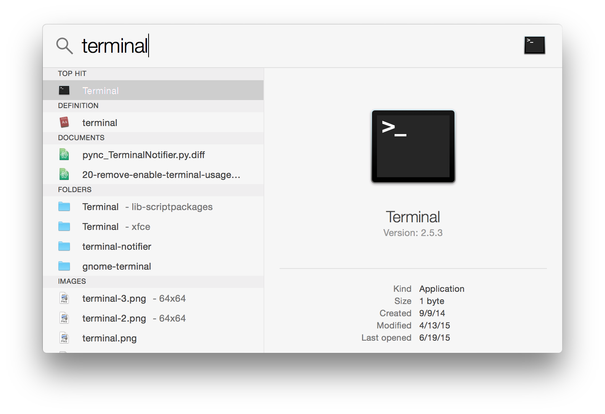

---
title: "Make a new project"
slug: make-new-project
---     

#Download Cocos2d-x

We shall be using the Cocos2d-x C++ game framework to make Doodler.

> [action]
> 
Go to the [Cocos2d-x downloads page](http://www.cocos2d-x.org/download) and click the link for the latest version (3.6 at the time of this writing) of the Cocos2d-x source code:

Make sure you don't accidentally download Coco2d-JS, Code IDE or Cocos. We're going to be using this copy of the source code as the base for the project.

> [action]
> 
Once you have downloaded it, move it to wherever you'd like your project to be saved in your filesystem. Then unzip it. Once you have unzipped it, you can delete the .zip file.

#Create a New Project

We're going to use the [Cocos2d Console](http://www.cocos2d-x.org/wiki/Cocos2d-console) tool to generate a new project.

> [info]
> 
Cocos2d Console is super great, because it will generate an Xcode-based iOS and Mac project, an Eclipse-based Android project and a Visual Studio-based Windows and Windows Phone project all with one command.
>
In our case we're just going to be using the Xcode project.

=

> [action]
> 
> In the unzipped folder, navigate to *tools/cocos2d-console/bin*. 

In there you will see an executable named *cocos*. This is the Cocos2d Console command line tool.

> Start a new *Terminal* session. 

If you're not familiar with [Terminal](https://en.wikipedia.org/wiki/Terminal_(OS_X)), it's OSX's built in shell. The default language used to interface with terminal is called (Bash)[https://en.wikipedia.org/wiki/Bash_(Unix_shell)].

> [action]
> 
You can start a new Terminal by first opening Spotlight either with the magnifying glass button in the top-right of the system menu, or with the keyboard shortcut Command-Space (⌘+Space)
>

>
Once there, type in terminal and hit enter.
>

Your new terminal window should look something like this:

We're going to navigate to the Cocos2d Console tool in Terminal so we can execute it.

> [action]
> 
In the terminal first, type `cd`. Then a space. Now click and drag the *bin* directory that we navigated to earlier over into the terminal. You should see a long path, something like this:
>

>
> Hit enter.

Now our terminal is in that directory. By the way, `cd` stands for *change directory*, it's the usual way to navigate the filesystem in Terminal.

To see what is in the active directory, type `ls` and hit enter. `ls` stands for list.

> [action]
> 
Try it now!

You should see something like this:

To execute an executable in terminal, you type `./` before its name. Then you can send it space separated parameters.

> [action]
> 
Type the following:
>
	./cocos new -p com.yourname.Doodler -l cpp -d ../../../.. Doodler
>
**Make sure you replace `yourname` with your name!**
>
Then hit enter.

A successful project creation looks like this:

This command will create a new Cocos2d-x project. The `-p` parameter specifies the package name, the `-l` parameter specifies the language (C++) and the `-d` parameter specifies the directory.  In Bash-land, `..` means the parent directory. So when we specified `../../../..` for the directory, that meant four directories up the tree, which will put the project right next to the Cocos2d-x source code directory that we downloaded and unzipped.

> [info]
> 
> At this point it's okay to delete the unzipped folder if you want; the process of making the new project the necessary Cocos2d-x source code was copied into the new project directory.

> [action]
> 
Navigate up four directories to the newly created *Doodler* one. From there, navigate to the Xcode project in *proj.ios_mac* and open it.
>

#Make it Portrait

The default Cocos2d-x template creates a landscape game, but we want this one to be portrait.  Thankfully it's easy to do in Xcode.

> [action]
> 
Click the project file at the top of the left panel (it says Doodler).
>

This will open a whole bunch of project properties that can be changed.

Under where it says *Deployment Info* there's a setting that says *Device Orientation*.

> [action]
> 
Uncheck the boxes for Landscape Left and Landscape Right and check Portrait. While you're at it, change the *Deployment Target* to 8.0.
>

The Deployment Target is the minimum version of iOS that we're going to support. Because later we'll want to use latest version of the Multipeer Connectivity framework, we're going to support only devices running iOS 8 and newer.

#Run It!

> [action]
> 
Click the big play button in Xcode's top bar. 

After a bit of time spent compiling the over 600 source files in Cocos2d-x, you should see this:

Now let's move on to making a drawing canvas!