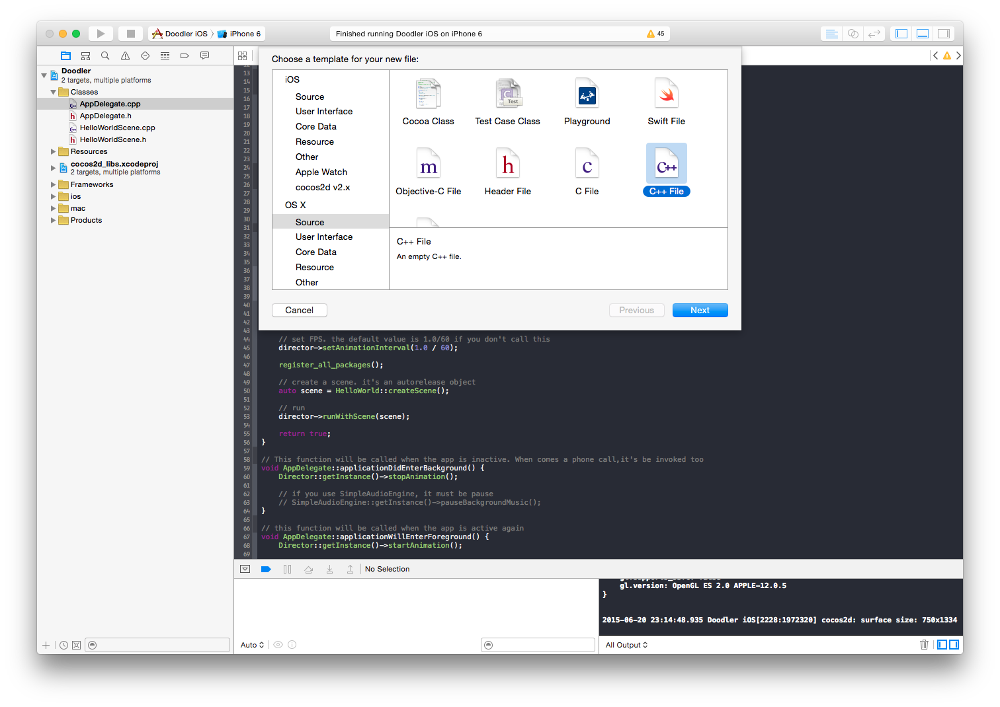
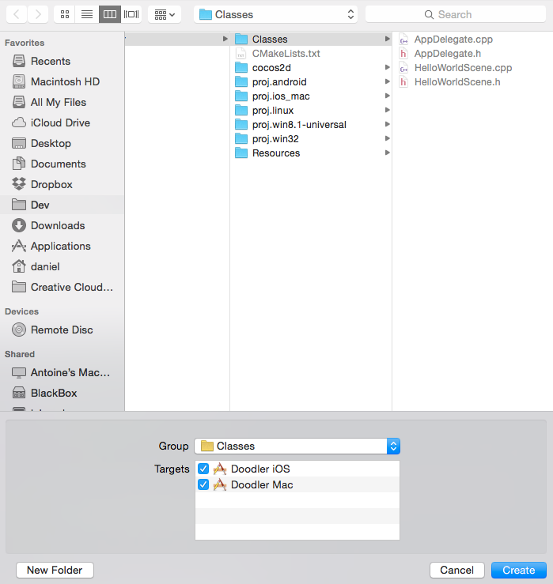
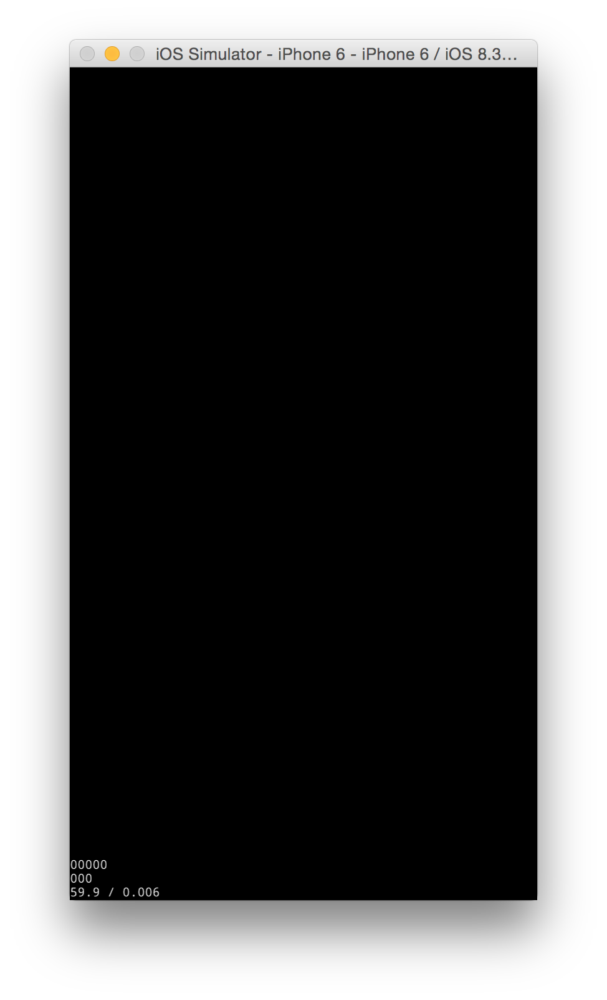
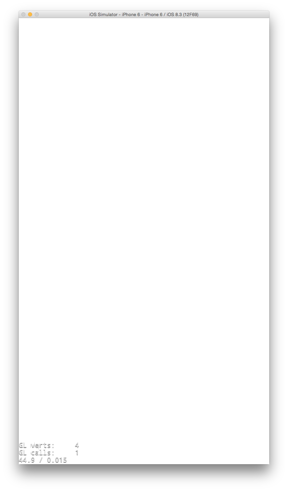
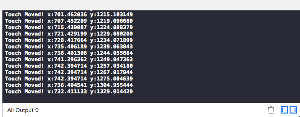

---
title: "Make a canvas"
slug: make-a-canvas
---     

#Create DrawingCanvas

First we're going to make a very simple drawing canvas. 

> [action]
> 
Create a new C++ file (File --> New --> File)
>

>
Name it `DrawingCanvas`. Make sure to save it your project's *Classes* directory and check the box for Doodler Mac.
>

When working on Cocos2d-x projects, with the exception of platform-specific code, your classes should always go in the *Classes* directory.

> [action]
> 
Open *DrawingCanvas.h*. First, delete `#include <stdio.h>`, we don't need it. Then, between the header guards, add the following:
>
	#include "cocos2d.h"
>
	class DrawingCanvas : public cocos2d::Node
	{
	public:
	    CREATE_FUNC(DrawingCanvas);
>	    
	protected:
	    cocos2d::DrawNode* drawNode;
>	    
	    bool init() override;
	    void onEnter() override;
	};
	
First, we `#include "cocos2d.h"`, which is standard for any class that inherits from a Cocos2d-x class. Then we declare our class, `DrawingCanvas`, which inherits from `cocos2d::Node`.

`Node` is one of the most base classes in Cocos2d-x - anything that is of type `Node` can be added to other nodes, and has properties like a `contentSize` and `position`.

Next, we use the `CREATE_FUNC` macro to which both declares and implements the `create()` function for us. So now, to create a `DrawingCanvas`, it's possible to call `DrawingCanvas::create()`. It's standard to use `CREATE_FUNC` for any class that inherits from a Cocos2d-x class.

> [info]
> 
If you're interested in seeing exactly what `CREATE_FUNC` does, you can command + click it (⌘ + click). `CREATE_FUNC` is a [C preprocessor](https://en.wikipedia.org/wiki/C_preprocessor) macro. The preprocessor language is one of the first steps in compilation. In this case, the `CREATE_FUNC` text in *DrawingCanvas.h* is replaced with the text of `CREATE_FUNC` definition, with the string `__TYPE__` replaced by the string passed as a parameter.

We declare a `protected` instance variable of type `DrawNode` called `drawNode`. `DrawNode` is a very convenient Cocos2d-x class for our purpose - it allows to you give it commands to draw primitives - things like points, lines, circles, rectangles, and triangles, and it handles the work of translating them to [OpenGL](https://en.wikipedia.org/wiki/OpenGL) to be rendered by the [GPU](https://en.wikipedia.org/wiki/Graphics_processing_unit). We will be using `drawNode` to render our lines.

Finally, we `override` the superclass methods `init()` and `onEnter()` - we'll use both to do some initialization.

Time to start implementing the drawing canvas.

> [action]
> 
> Open up *DrawingCanvas.cpp*
> 
> First, below `#include DrawingCanvas.h` add this:
> 
	using namespace cocos2d;
	
This tells the compiler that it can infer the usage of the cocos2d namespace for all the code in DrawingCanvas.cpp. It's standard to include `using namespace cocos2d;` in the implementation (.cpp file) of any Cocos2d-x subclass.

> [action]
> 
First, add the standard skeleton for an overriden `init()` method:
>
	bool DrawingCanvas::init()
	{
	    if (! Node::init())
	    {
	        return false;
	    }
>	    
	    return true;
	}
	
Because we overrode the superclass' `init()` method, we're careful to call it in our implementation with `Node::init()`. 

> [action]
> 
Next, let's create `drawNode`. Before the final `return`, add this:
>
    drawNode = DrawNode::create();
>   
    this->addChild(drawNode);
    
This is fairly simple - we first create a drawNode, then add it as a child to `this` - the `DrawingCanvas`.

But we have a problem - like most `Node`s, the `contentSize` of `drawNode` is initialized to (0, 0). Instead, we want the `drawNode` to be fullscreen - that is, it has the same content size as the screen.

The way Cocos2d-x works, many things won't have a `contentSize` until they're added to a scene and about to be displayed. Luckily, there's a method that's called as that is about to happen: `onEnter()`. 

> [action]
> 
Time to implement `onEnter()`:
>
	void DrawingCanvas::onEnter()
	{
	    Node::onEnter();
	}
	
Again, like in `init()`, we're careful to call the superclass method that we overrode.  In most cases when overriding a Cocos2d-x superclass method, you will want to call the superclass method - bad things can happen if you forget.

> [action]
> 
Add the following to `onEnter()`
>
    Size visibleSize = CCDirector::getInstance()->getVisibleSize();
>   
    this->setContentSize(visibleSize);
    drawNode->setContentSize(visibleSize);
    
We first ask the `Director` the size of the screen. We store that value in the variable `visibleSize`. Then we set both the `drawNode` and this class' `contentSize` to the visible size so that they'll both occupy the full screen.

> [info]
> 
The `Director` is the main managing class of Cocos2d-x. It manages scene transitions, and the windows that are being rendered to. It holds references to the `Scheduler`, `ActionManager` and `TouchDispatcher` all of which are also very important, and can be accessed through the `Director`.

#Clean Up HelloWorldScene

`HelloWorldScene` has some template code that we don't need in it.

> [action]
Open *HelloWorldScene.cpp*. Delete all of the following code:
>
    Size visibleSize = Director::getInstance()->getVisibleSize();
    Vec2 origin = Director::getInstance()->getVisibleOrigin();
>
    /////////////////////////////
    // 2. add a menu item with "X" image, which is clicked to quit the program
    //    you may modify it.
>
    // add a "close" icon to exit the progress. it's an autorelease object
    auto closeItem = MenuItemImage::create(
                                           "CloseNormal.png",
                                           "CloseSelected.png",
>                                          CC_CALLBACK_1(HelloWorld::menuCloseCallback, this));
>    
	closeItem->setPosition(Vec2(origin.x + visibleSize.width - closeItem->getContentSize().width/2 ,
                                origin.y + closeItem->getContentSize().height/2));
>
    // create menu, it's an autorelease object
    auto menu = Menu::create(closeItem, NULL);
    menu->setPosition(Vec2::ZERO);
    this->addChild(menu, 1);
>
    /////////////////////////////
    // 3. add your codes below...
>
    // add a label shows "Hello World"
    // create and initialize a label
>   
    auto label = Label::createWithTTF("Hello World", "fonts/Marker Felt.ttf", 24);
>    
    // position the label on the center of the screen
    label->setPosition(Vec2(origin.x + visibleSize.width/2,
                            origin.y + visibleSize.height - label->getContentSize().height));
>
    // add the label as a child to this layer
    this->addChild(label, 1);
>
    // add "HelloWorld" splash screen"
    auto sprite = Sprite::create("HelloWorld.png");
>
    // position the sprite on the center of the screen
    sprite->setPosition(Vec2(visibleSize.width/2 + origin.x, visibleSize.height/2 + origin.y));
>
    // add the sprite as a child to this layer
    this->addChild(sprite, 0);
    
This code creates the splash screen sprite, the "Hello World" label and the menu with the close button that we saw the first time we ran the project.

> [action]
> 
In its place, add the following:
>
	 DrawingCanvas* drawingCanvas = DrawingCanvas::create();
>   
    this->addChild(drawingCanvas);
>
You will find that you need to `#include "DrawingCanvas.h"` at the top so that the compiler knows about it.

=

> [action]
>   
Also, we can delete the `menuCloseCallback` method below `init()`, as we've just deleted the menu that used it. Don't forget to delete the declaration in *HelloWorldScene.h*.

Now try running it!

You should get... a blank screen! Well, at least it's something different.

#Add a Background

Let's make the background of `DrawingCanvas` white so that it can be drawn on.

> [action]
> 
In *DrawingCanvas.h*, declare a `protected` instance variable of type `cocos2d::LayerColor*` called `background`;

`LayerColor` is just what it sounds like - a kind of `Node` that can display a color.

> [action]
> 
In *DrawingCanvas.cpp*, in `init()` right below where we instantiated `drawNode`, create a `LayerColor`:
>
    background = LayerColor::create(Color4B(255, 255, 255, 255));
>   
Then add it as a child:
>
	this->addChild(background);
>
Make sure to add `background` before `drawNode` - that way the `background` will be behind `drawNode` and the drawn things will appear on top.

=

> [info]
> 
`LayerColor`'s `create()` method takes one parameter, a `Color4B` specifying RGBA values. RGBA stands for **R**ed, **G**reen, **B**lue, **A**lpha; alpha means the same thing as opacity and transparency. The `B` in `Color4B` stands for byte, indicating that the parameters should be integers in the range of 0 to 255. Often color values will be represented as a `float` in the range of 0.0f to 1.0f instead. In this case, four values of 255 indicate that the background should be pure white and fully opaque.

Try running it!

Good news, it should now be white.

#Add Touch Handling

It's vitally important for a drawing app that we can detect touches on the screen, so that we can draw!

> [action]
> 
In *DrawingCanvas.h*, add a declaration for the following `protected` method:
>
	void setupTouchHandling();
>	    
Then in *DrawingCanvas.cpp* add an empty implementation:
>
	void DrawingCanvas::setupTouchHandling()
	{
>	    
	}
	
=
> [action]
> 	
Inside `setupTouchHandling()` create a `touchListener` which will notify us of touches:
>
	auto touchListener = EventListenerTouchOneByOne::create();
>	
We want to be notified when the user touches and moves their finger on the screen, so add these:
>
    touchListener->onTouchBegan = [&](Touch* touch, Event* event)
    {
        return true;
    };

    touchListener->onTouchMoved = [&](Touch* touch, Event* event)
    {
>       
    };
    
Both `onTouchBegan` and `onTouchMoved` are *lambda expressions*. Any code we put inside those code blocks will be executed every time a touch on the screen begins or moves respectively.

We return `true` in `onTouchBegan` to indicate that we want to be notified of any changes with that touch in `onTouchMoved`. If we returned `false` instead, then `onTouchMoved` would never get called.

Now we have to add our `touchListener` to the `EventDispatcher` so that Cocos2d-x knows to report touch events to it.  

> [action]
> 
At the end of `setupTouchHandling()` (outside of the `onTouchMoved` block) add this:
>
    this->getEventDispatcher()->addEventListenerWithSceneGraphPriority(touchListener, this);

So far, if we were to run the project again, nothing would change.  Part of the problem is that we're not yet calling `setupTouchHandling()` so none of the code in there does anything yet.

> [action]
> 
Add a call to `setupTouchHandling()` to `onEnter()` so that this setup code is run.

Let's check to see that this is working. First we need to take the `touch` parameter that is passed into our lamda expression and convert it into a location within the drawNode.

> [action]
> 
Inside the `onTouchMoved` block, add this line:
>
	Vec2 touchPos = drawNode->convertTouchToNodeSpace(touch);
	
Before we even try to do any drawing, let's just log those results to console so that we can see if it works.

Add this line next:

	CCLOG("Touch Moved! x:%f y:%f", touchPos.x, touchPos.y);
	
This will print to the console string `Touch Moved!` followed by the x and y coordinates of the touch. It should look like this:

	
> [info]
> 
`CCLOG` is a convenient macro function that accepts a formatted string and prints it out to the console. You can read more about how you can format the string by reading the [`printf` manual](http://www.cplusplus.com/reference/cstdio/printf/). `printf` and `CCLOG` behave very similarly. 
>
Unlike `printf`, `CCLOG` has the nice property that it's cross platform - it was designed that way. Interestingly it only works in debug builds - logging can be expensive in terms of processing power and Cocos2d-x is clever in that it has the compiler remove `CCLOG`s for release builds so as to not adversely affect performance.

Great! Now let's figure out how to draw something to the screen.
