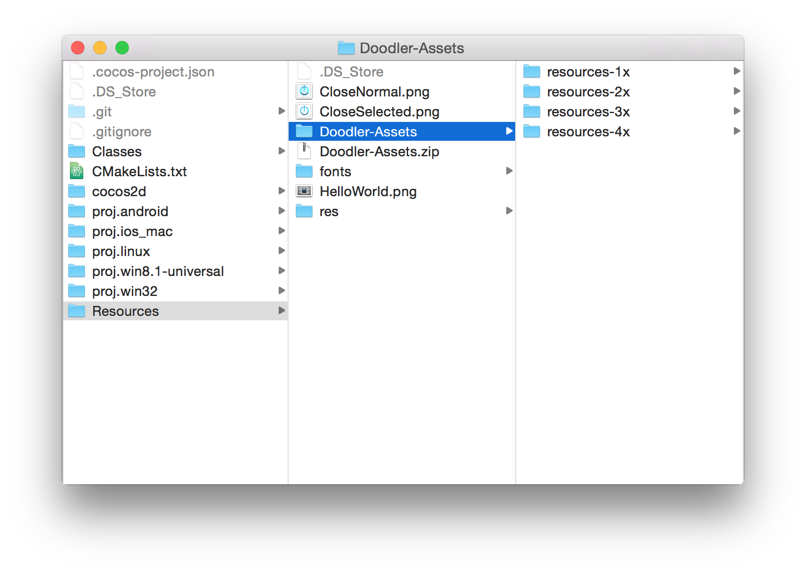
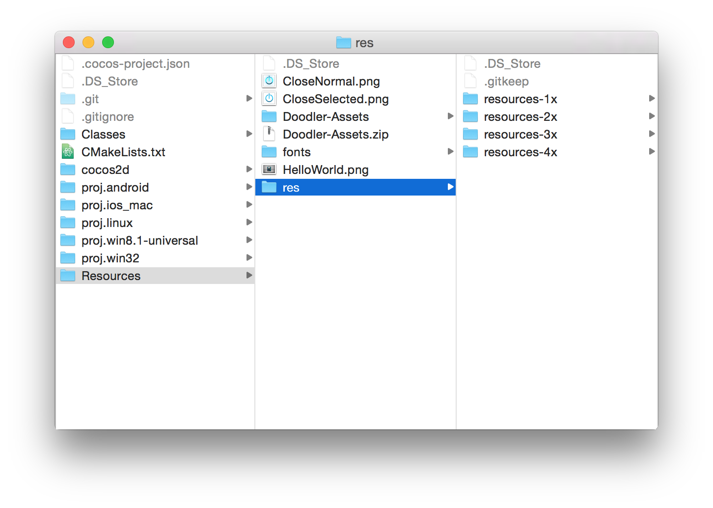
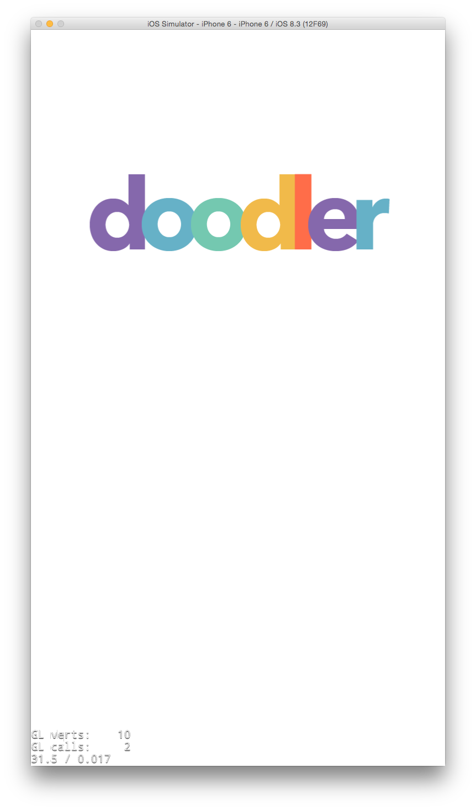
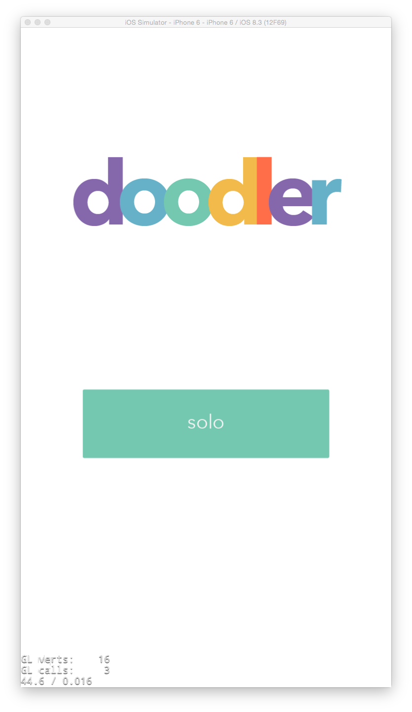
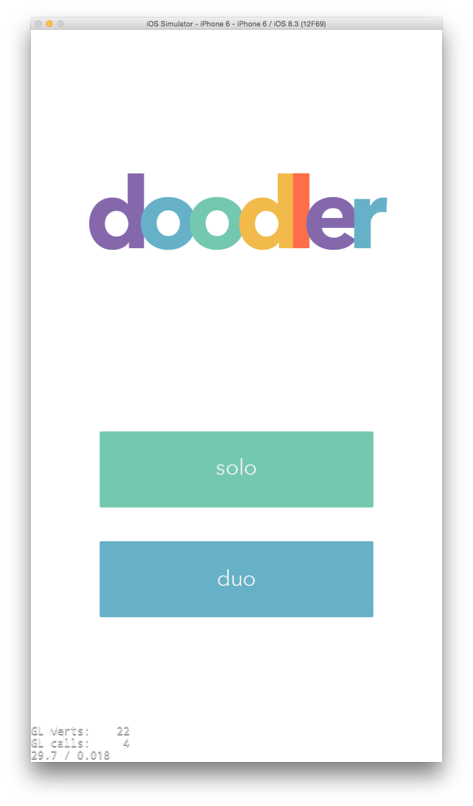

---
title: "Make the lobby"
slug: making-the-lobby
---     

Now we'll make the lobby scene, which will be the first thing the user sees when the start the app. It will contain the Doodler logo, in addition to a single player and multiplayer button.

#Create a Lobby Class

> [action]
> 
> Create a new C++ class `Lobby` that inherits from `cocos2d::Node`. Have it `override` `init()` and `onEnter()` just like how `DrawingCanvas` did. Set up *Lobby.h* with the declarations and *Lobby.cpp* with empty implementations.
 
See if you can do it without looking at the solution. It's very common to create new classes that inherit from a Cocos2d-x base class, so you should try to get used to memorizing the steps required.

> [solution]
> 
Here's what your Lobby skeleton should look like:
>
*Lobby.h*
>
	#ifndef __Doodler__Lobby__
	#define __Doodler__Lobby__
>
	#include "cocos2d.h"
>
	class Lobby : public cocos2d::Node
	{
	public:
	    CREATE_FUNC(Lobby);
>	    
	protected:
	    bool init() override;
	    void onEnter() override;
>	    
	};
>
	#endif /* defined(__Doodler__Lobby__) */
>	
*Lobby.cpp*
>
	#include "Lobby.h"
>
	using namespace cocos2d;
>
	bool Lobby::init()
	{
	    if (! Node::init())
	    {
	        return false;
	    }
>	    
	    return true;
	}
>
	void Lobby::onEnter()
	{
	    Node::onEnter();
	}
	
#Add a Background
	
By default, the lobby will have a black background color. Let's change that by creating a background in `Lobby::init()`.

> [action]
> 
Add the background:
>
	LayerColor* background = LayerColor::create(Color4B(255, 255, 255, 255));
	this->addChild(background);
	
#Load the Lobby

The way we set things up, `DrawingCanvas` gets loaded and displayed first. Let's change it so that `Lobby` is displayed first. 

> [action]
> 
Open *HelloWorldScene.cpp*. Swap the `#include "DrawingCanvas.h"` at the top with `#include "Lobby.h"`.
>
Then, in `HelloWorld::init()` `create()` a new `Lobby` instead of `DrawingCanvas` and add that `lobby` as a child.

#Add Some Assets

We're going to need some assets for the logo and buttons in the lobby.

> [action]
Get started by [downloading the asset pack](https://raw.githubusercontent.com/MakeSchool-Tutorials/Doodler-Cpp/master/P3-Make-the-Lobby/Doodler-Assets.zip).
>
Save it in the *Resources* directory inside your project folder.
>
Double click *Doodler-Assets.zip* to unzip it.
>
It should look like this:
>

>
Drag the *resources* directories out of the *Doodler-Assets* directory, and into *res*. The result should look like this:
>

Feel free to delete Doodler-Assets.zip and the Doodler-Assets directory, as we now no longer need them.

#Set up Resolution-Dependent Asset Loading

The assets are now included in the Xcode project, which is great. But we need to tell Cocos2d-x which assets to load depending on what the screen resolution is.

> [action]
> 
Open *AppDelegate.cpp*. In `applicationDidFinishLaunching`:
>
Right below:
>
    director->setAnimationInterval(1.0 / 60);
>   
Add this:
>
	FileUtils::getInstance()->addSearchPath("res");
>
	cocos2d::Size targetSize = glview->getFrameSize();
>	 
	std::vector<std::string> searchResolutionsOrder(1);
>   
	if (targetSize.height < 481.0f)
	{
		searchResolutionsOrder[0] = "resources-1x";
	}
	else if (targetSize.height < 1335.0f)
	{
		searchResolutionsOrder[0] = "resources-2x";
	}
	else if (targetSize.height < 1921.0f)
	{
		searchResolutionsOrder[0] = "resources-3x";
	}
	else
	{
		searchResolutionsOrder[0] = "resources-4x";
	}
>    
	FileUtils::getInstance()->setSearchResolutionsOrder(searchResolutionsOrder);

The first line tells Cocos2d-x to search for assets in the *res* directory. That way, when we're loading the assets in code, we don't have to specify res every time, like "res/logo.png". Instead we can just specify "logo.png".

Next we figure out the screen size and assign that to `targetSize`. 

We create a `vector` called `searchResolutionsOrder` - in this vector we will specify the order that Cocos2d-x should search our resource folders to find matching assets. It's basically a fallback mechanism - say we need a 4x-sized "logo.png", but there isn't one in the *resources-4x* directory. If we specify multiple directories in the `searchResolutionsOrder` vector, then it can then search the next directory, like *resources-3x* instead.

In this case, however, we have assets for each resolution size, 1x through 4x. So we just specify one directory to find the assets in, based on the height of the screen.

The last line passes the `searchResolutionsOrder` vector to `FileUtls` so it can use it as it searches for assets.

#Add the Logo

We're going to create the logo sprite and buttons in a `Lobby` method called `setupUI()`.

> [action]
> 
Open *Lobby.h*. Declare a `protected` method called `setupUI()` with no parameters and return type `void`.
>
Open *Lobby.cpp* and create an empty implementation of `setupUI()`.

=

> [solution]
> 
	void Lobby::setupUI()
	{
>	    
	}

We're going to use *relative positioning* to make sure all of our UI looks good at all device resolutions. So instead of hardcoding a position, as in, "the logo will be at (200, 400)", we will instead ask the `Director` what the visible screen size is and compute a position based on that.

> [action]
So in `setupUI()`, let's figure out the screen size:
>
	Size visibleSize = Director::getInstance()->getVisibleSize();

Now let's make the Doodler logo that we shall display.

> [action]
> 
First, create the logo `Sprite` like this:
>
	Sprite* logo = Sprite::create("doodlerLogo.png");
>	
Next set the anchor point to the middle of the `Sprite`.
>
	logo->setAnchorPoint(Vec2(0.5f, 0.5f));
>	
Now we'll position the logo in the middle of screen's width, and 75% of its height.
>
    logo->setPosition(Vec2(visibleSize.width * 0.5f, visibleSize.height * 0.75f));
 >   
Finally, add the logo as a child of `Lobby`:
>
	this->addChild(logo);
>	
Now we need to add a call to `setupUI()` in `onEnter()`. Go ahead and do that.

Now try running it! You should see something like this:

#Add Some Buttons

Okay, now it's time to add some buttons for the users to press. There will be a single player mode button - that one says "solo", and a multiplayer button that says "duo". 

These buttons will use *callbacks*. Callbacks are methods we write in our class that are triggered whenever the button is pressed.

> [action]
> 
In *Lobby.h*, declare the following `protected` callback method:
>
	void soloPressed(cocos2d::Ref* pSender, cocos2d::ui::Widget::TouchEventType eEventType);
>	
You will find that the compiler complains that it doesn't know what a `cocos2d::ui::Widget` is - we can fix that by adding another `#include` at the top:
>
	#include "CocosGUI.h"
	
We declared the callback like this because it's the way Cocos2d-x expects it to be declared. When the single player button is pressed, it will notify us by calling `soloPressed`, and it will pass a reference to the `pSender` of the button press (something we can specify, but won't use in this case) and also what kind of press it is, via `eEventType`.

> [action]
Time to implement an empty method for the callback. Add this to *Lobby.cpp*:
>
	void Lobby::soloPressed(Ref *pSender, ui::Widget::TouchEventType eEventType)
	{
>
	}

We'll fill in more of that method later.

So now let's make the single-player mode button.

> [action]
> 
In `setupUI()` below where we created the `logo`, make a button:
>
	ui::Button* soloButton = ui::Button::create();
>
Set the anchor point to be in the middle:
>
	soloButton->setAnchorPoint(Vec2(0.5f, 0.5f));
>	
and set the position to be in the middle of the screen's width, and 40% up the screen's height:
>
    soloButton->setPosition(Vec2(visibleSize.width / 2.0f, visibleSize.height * 0.4f));
>   
Next we'll tell the button to use the appropriate images from the asset pack. The first parameter specifies the image for the *normal* state, and the second is the image for the *pressed* state.
>
    soloButton->loadTextures("soloButton.png", "soloButtonPressed.png");
>   
Now we'll tell the button about the `soloPressed` callback method that we made earlier:
>
	soloButton->addTouchEventListener(CC_CALLBACK_2(Lobby::soloPressed, this));
>	
Finally, we add the button to the `Lobby`.
>
    this->addChild(soloButton);
    
So now your lobby should look like this:

> [action]
> 
Now it's your turn to code the `duoButton`. You'll have to create the `duoPressed` callback, and don't forget to load the correct images. It should be positioned in the middle of the width of the screen, and 25% up the height of the screen.

When you're done with that, your lobby should look like this:

#Make the Solo Button Work

Let's make it so that we can transition to the drawing canvas if the user clicks the solo button.

> [action]
> 
In the `soloPressed` callback, add this:
>
	if (eEventType == ui::Widget::TouchEventType::ENDED)
	{
>
	}
	
`soloPressed` is called when the touch begins, and as the touch is moving, but we want to only transition if the touch ends on the button, to be sure the user didn't accidently touch it.

> [action]
> 
Inside the `if` block, add this code:
>
	Scene* scene = Scene::create();
>	   
	DrawingCanvas* drawingCanvas = DrawingCanvas::create();
	scene->addChild(drawingCanvas);
>	   
	Director::getInstance()->pushScene(scene);
    
First we create a new `Scene`, then we create a new instance of `DrawingCanvas` and add it to the `scene`. Finally we tell the `Director` to switch to our newly created scene.

> [action]
> 
The compiler will complain that it doesn't know what `DrawingCanvas` is, don't forget to `#include` it at the top!

<video width="100%" controls>
	<source src="https://s3.amazonaws.com/mgwu-misc/Doodler+Cpp+Tutorial/lobbyToCanvas.mov" type="video/mp4">
</video>

Nice! Now let's start polishing up the `DrawingCanvas`.