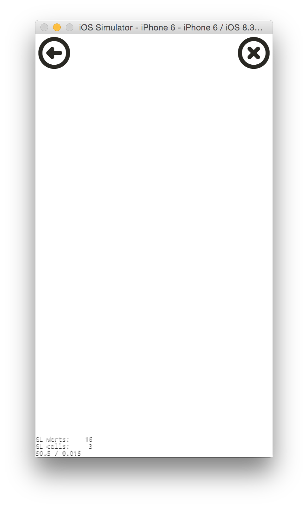
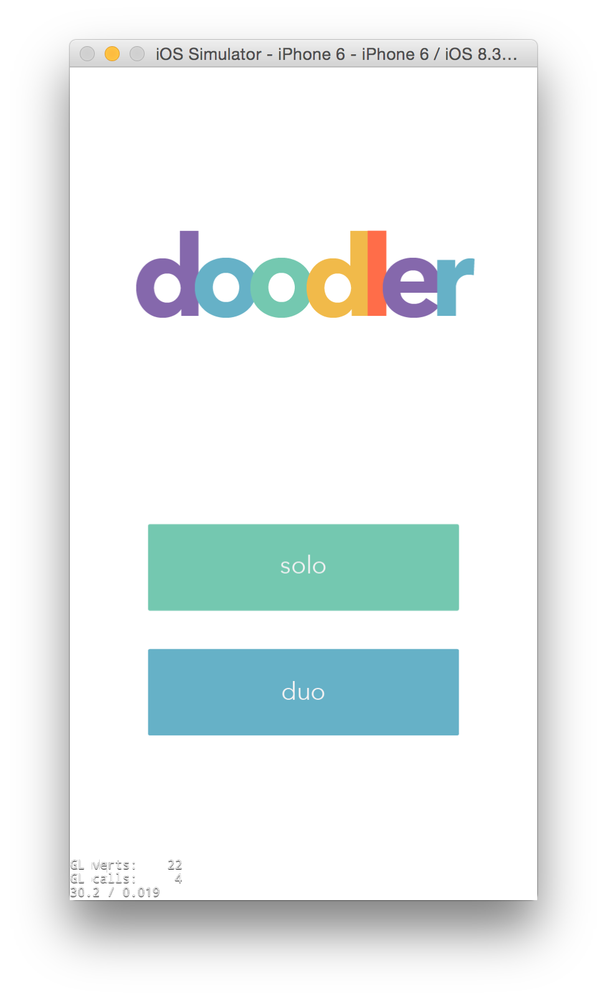
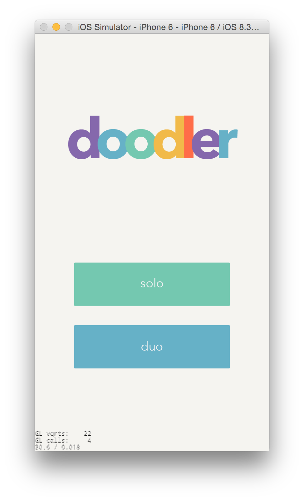
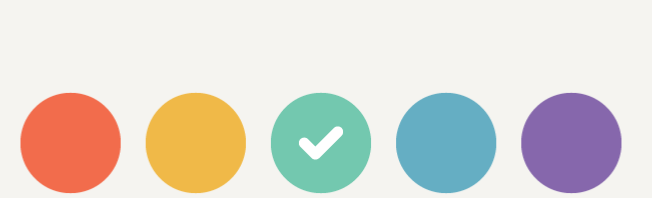
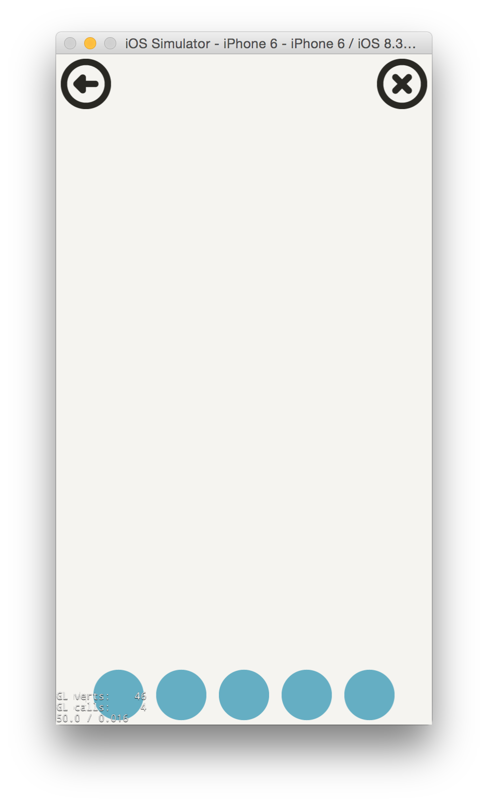
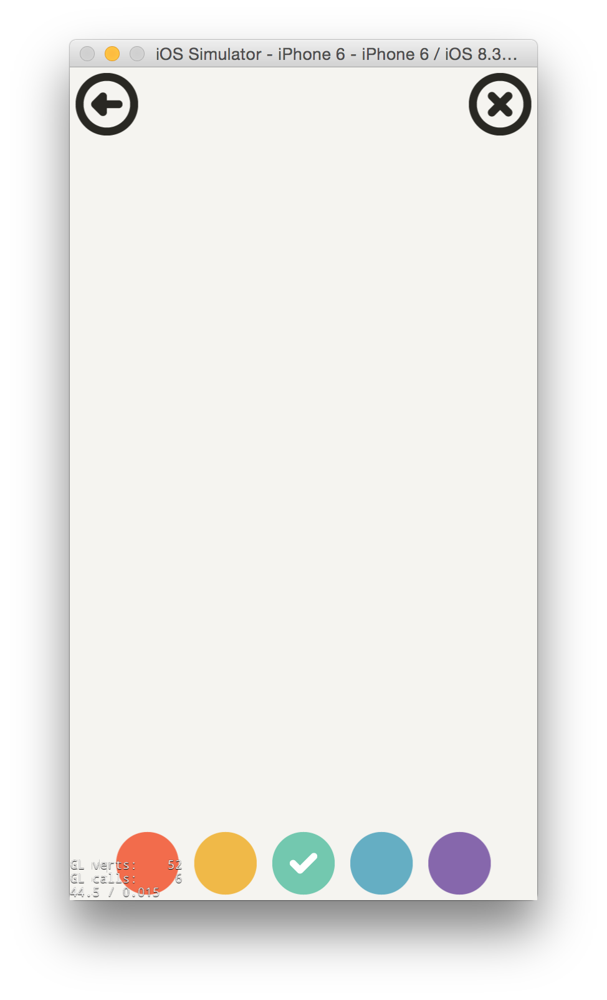

---
title: "Make it pretty"
slug: make-it-pretty
---     

Now that we have the basics of the app down, it's time to polish the UI to make it friendly and fun to use.

But first, let's add some more functionality.

#Clear and Back Buttons

We're going to add a button to `DrawingCanvas` that will clear the canvas of any drawings, and another that will take the user back to the lobby.

> [action]
> 
First declare a new `protected` method called `void setupMenus()`. 
>
In the implementation of `setupMenus()`, get the visible size of the screen and store it in a variable called `visibleSize`. Look at your implementation of `onEnter()` if you forget how to do that.

<!--comment to break up action blocks-->

> [action]
> 
Next, create and add two new instances of `ui::Button*` with these properties:
>
<table>
	<thead>
		<tr>
			<th align="center">Button Name</th>
			<th align="center">Position</th>
			<th align="center">Texture</th>
			<th align="center">Pressed Texture</th>
			<th align="center">Callback Method Name</th>
		</tr>
		</thead>
		<tbody>
		<tr>
			<td>clearButton</td>
			<td>top right corner</td>
			<td>clearButton.png</td>
			<td>clearButtonPressed.png</td>
			<td>clearPressed</td>
		</tr>
		<tr>
			<td>backButton</td>
			<td>top left corner</td>
			<td>backButton.png</td>
			<td>backButtonPressed.png</td>
			<td>backPressed</td>
		</tr>
	</tbody>
</table>
>
Don't forget to also code the callback methods! For those, we only want to register the touch if it is `TouchEventType::ENDED`. Also don't forget to `#include "CocosGUI.h` in *DrawingCanvas.h*. You should have learned everything you need to do this yourself, so try not to look at the solution.

<!--html comment to break up boxes-->

> [solution]
> 
The code in `setupMenus()`:
>
    ui::Button* clearButton = ui::Button::create();
    clearButton->setAnchorPoint(Vec2(1.0f, 1.0f));
    clearButton->setPosition(Vec2(visibleSize.width, visibleSize.height));
    clearButton->loadTextures("clearButton.png", "clearButtonPressed.png");
    clearButton->addTouchEventListener(CC_CALLBACK_2(DrawingCanvas::clearPressed, this));
    this->addChild(clearButton);
>   
    ui::Button* backButton = ui::Button::create();
    backButton->setAnchorPoint(Vec2(0.0f, 1.0f));
    backButton->setPosition(Vec2(0.0f, visibleSize.height));
    backButton->loadTextures("backButton.png", "backButtonPressed.png");
    backButton->addTouchEventListener(CC_CALLBACK_2(DrawingCanvas::backPressed, this));
    this->addChild(backButton);
>
The callback methods:
>
	void DrawingCanvas::clearPressed(Ref* pSender, ui::Widget::TouchEventType eEventType)
	{
	    if (eEventType == ui::Widget::TouchEventType::ENDED)
	    {
>
	    }
	}
>
	void DrawingCanvas::backPressed(cocos2d::Ref *pSender, cocos2d::ui::Widget::TouchEventType eEventType)
	{
	    if (eEventType == ui::Widget::TouchEventType::ENDED)
	    {
>
	    }
	}

<!--html comment to break the boxes-->
> [action]
> 
Add a call to `setupMenus()` in `onEnter()` so that our buttons are created.

Your canvas should now look like this:

#Implement the Buttons

Making the buttons work is really simple. `DrawNode` already has a method to clear the canvas. So in `clearPressed()`, after checking that the touch type is `ENDED`, clear the `drawNode`:

	drawNode->clear();
	
The back button implementation is also one line - we'll actually change it later, but for now, add this in `backPressed()`:

	Director::getInstance()->popScene();

Test it out! It should work well.

<!--A video here would be nice-->

#Create Constants.h

Doodler will have fixed color palette: 5 colors and white. The user will be able to choose from the 5 colors to draw with, and the background color will be white.

We're going to define those colors in a new header file.

> [action]
> 
Create a new *Header File* (*File > New > File*) and name it *Constants.h.*. Make sure you check Doodler iOS and Doodler Mac as targets.

<!--html comment to separate blocks-->

> [info]
> 
It's very common to declare new types and constant values that will are used by multiple classes in a single header file called *Constants* (or sometimes *Globals*). That way, multiple classes can use the same types without having to `#include` each other. This helps to maintain [separation of concerns](https://en.wikipedia.org/wiki/Separation_of_concerns).
>
In this case, the colors are only used by by `DrawingCanvas`. But it's still useful to declare them in a separate file, because then we can change them easily. Whenever you find yourself using a [magic number](https://en.wikipedia.org/wiki/Magic_number_(programming)#Unnamed_numerical_constants), consider if it would make more sense for that number to live in a more accessible  *Constants* file. Magic numbers are also called *unnamed numerical constants*. It means a number that appears in the source code, without any indiciation of what it represents.

<!--html comment to separate blocks-->

> [action]
>
Inside the header guards of *Constants.h*, add the following variable definitions:
>
	#include "cocos2d.h"
>
	static const float INITIAL_RADIUS = 4.0f;
>
	static const cocos2d::Color4F COLOR_PURPLE =  cocos2d::Color4F(134/255.0f, 103/255.0f, 172/255.0f, 1.0f);
	static const cocos2d::Color4F COLOR_BLUE   =  cocos2d::Color4F(101/255.0f, 174/255.0f, 195/255.0f, 1.0f);
	static const cocos2d::Color4F COLOR_GREEN  =  cocos2d::Color4F(115/255.0f, 200/255.0f, 175/255.0f, 1.0f);
	static const cocos2d::Color4F COLOR_YELLOW =  cocos2d::Color4F(240/255.0f, 185/255.0f, 72/255.0f, 1.0f);
	static const cocos2d::Color4F COLOR_RED    =  cocos2d::Color4F(242/255.0f, 108/255.0f, 76/255.0f, 1.0f);
	static const cocos2d::Color4F COLOR_WHITE  =  cocos2d::Color4F(245/255.0f, 244/255.0f, 240/255.0f, 1.0f);
	
<!--html comment to separate boxes-->
	
> [action]
> 
Next go to *DrawingCanvas.cpp* and `#include "Constants.h"` at the top. Change the magic number `4.0` in `drawNode->drawSegment()` to instead be `INITIAL_RADIUS`. Next, in the `init()` method, where we create the background color, change this:
>
	background = LayerColor::create(Color4B(255, 255, 255, 255));
>	
to this:
>
	background = LayerColor::create(Color4B(COLOR_WHITE));
	
You may notice that `COLOR_WHITE` isn't pure white, it's actually slightly off-white. (RGB is 245, 244, 240 instead of 255, 255, 255). That's because we would like to create the look and feel of drawing on paper, and there's no real paper that is truly pure white.

> [action]
> 
Now do the same for `Lobby` - make sure the background uses `COLOR_WHITE` instead of pure white.

It's important in game design to be careful about the colors and art we use - we want to present a consistent look and feel to the user.

> [action]
> 
Try running it! Can you see the difference?

The difference between the off-white and pure white might not be immediately obvious. But when compared side-to-side, it should be:

 

Now can you see the difference?

#Add the Color Pickers

We're going to let the user pick between 5 different colors to draw to the canvas with. They are red, yellow, green, blue and purple. So let's create the interface that will allow the user to pick. We're going to display 5 round color picker buttons, each with a different color. When the user picks one, we'll display a white checkmark on top of the color button.

It will look like this:

First, we'll create an instance variable for the checkmark sprite because we will want to be able to access it from different methods in `DrawingCanvas.cpp`.

> [action]
> 
Add the `protected` instance variable to *DrawingCanvas.h*:
>
	cocos2d::Sprite* check;
>	
While you're at it, add the instance variable that we will use to store the user's currently selected color:
>
	cocos2d::Color4F selectedColor;
	
Also, let's add the callback method for when the user presses a color button:
>
	void colorChangePressed(cocos2d::Ref* pSender, cocos2d::ui::Widget::TouchEventType eEventType);
>
Now flip over to *DrawingCanvas.cpp*. 
>
Add an empty implementation of `colorChangePressed`.
>
In `setupMenus()`, create the `check` sprite using the `"checkMark.png`" image. Set the *anchor point* to (0.5, 0.5) and the *normalized position* to (0.5, 0.5). 

It's very convenient to be able to set the normalized position - instead of specifying the position in pixels, we get to specify the position in a percentage of the parent's size, where `0` is 0% and `1.0f` is 100%. So for example, by setting the normalized position to (0.5, 0.5), we tell the `check` `Sprite` to appear right in the middle of its parent.

> [solution]
> 
    check = Sprite::create("checkMark.png");
    check->setAnchorPoint(Vec2(0.5f, 0.5f));
    check->setNormalizedPosition(Vec2(0.5f, 0.5f));

Next, we'll create a `Node` called `colorButtonLayout` that will hold the 5 color buttons. That way, if we ever choose move the color watches, we can just reposition the `colorButtonLayout` instead of having to move each button individually. In general, it's a good idea to organize your menus into different nodes to make positioning and resizing easier.

> [action]
> 
Create a new `Node` called `colorButtonLayout`. Make it have a width that is same as the `visibleSize` width, and a height that is 20% of the `visibleSize` height. Set the *anchor point* to be (0.5, 0.0). Set the position so that it is in the middle-bottom of the screen. Then add it as a child to the scene.

<!--html comment to break blocks-->

> [solution]
> 
    Node* colorButtonLayout = Node::create();
    colorButtonLayout->setContentSize(Size(visibleSize.width, visibleSize.height * 0.2f));
    colorButtonLayout->setAnchorPoint(Vec2(0.5f, 0.0f));
    colorButtonLayout->setPosition(Vec2(visibleSize.width / 2.0f, 0.0f));
    this->addChild(colorButtonLayout);
    
Now we will create and add all 5 color buttons, using a `for` loop.

> [action]
> 
We will start and index `i = 1`, which will make positioning the buttons easier. Add this loop to `setupMenus()`.
>
    for (int i = 1; i <= 5; ++i)
    {
>   
    }
>
Inside the loop, create a new `ui::Button*` called `colorButton`.
Set the following properties:
>
- *anchor point* - `(0.5f, 0.0f)`
- *textures* - `"colorSwatch.png" for both normal and pressed states
- *touch event listener* - DrawingCanvas::colorChangePressed
>
For now, let's set all the button colors to blue:
>
	colorButton->setColor(Color3B(COLOR_BLUE));
>
Then add the button to the `colorButtonLayout`:
>
	colorButtonLayout->addChild(colorButton);

<!--html comment to break boxes-->

> [action]
> 
Now set the positions of the buttons so that it looks like this. You can use the `i` index in the for loop to help. Keep in mind that it should reposition naturally for various device resolutions.

> [solution]
> 
> When you're done, it should look something like this:
> 
	for (int i = 1; i <= 5; ++i)
	{
	   ui::Button* colorButton = ui::Button::create();
	   colorButton->setAnchorPoint(Vec2(0.5f, 0.0f));
	   colorButton->setPosition(Vec2(visibleSize.width * i * (1.0f/6.0f), 0.0f));
	   colorButton->loadTextures("colorSwatch.png", "colorSwatch.png");
	   colorButton->addTouchEventListener(CC_CALLBACK_2(DrawingCanvas::colorChangePressed, this));
	   colorButton->setColor(Color3B(COLOR_BLUE));
	   colorButtonLayout->addChild(colorButton);
	}
	
Now lets assign the colors to the buttons. Assign the colors in this order: `RED`, `YELLOW`, `GREEN`, `BLUE`, `PURPLE`.

Finally, we're going to have the default color be `GREEN`. So on the green button, add the `check` as a child like this:

	colorButton->addChild(this->check);
	
So now it should look like this:

#Implement Color Picking

#Playing with the Stroke