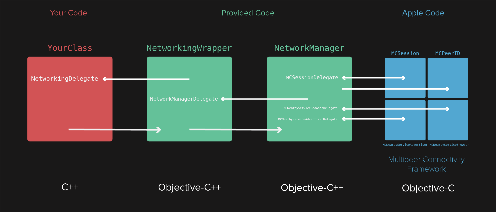
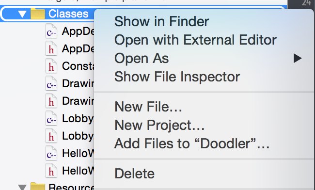
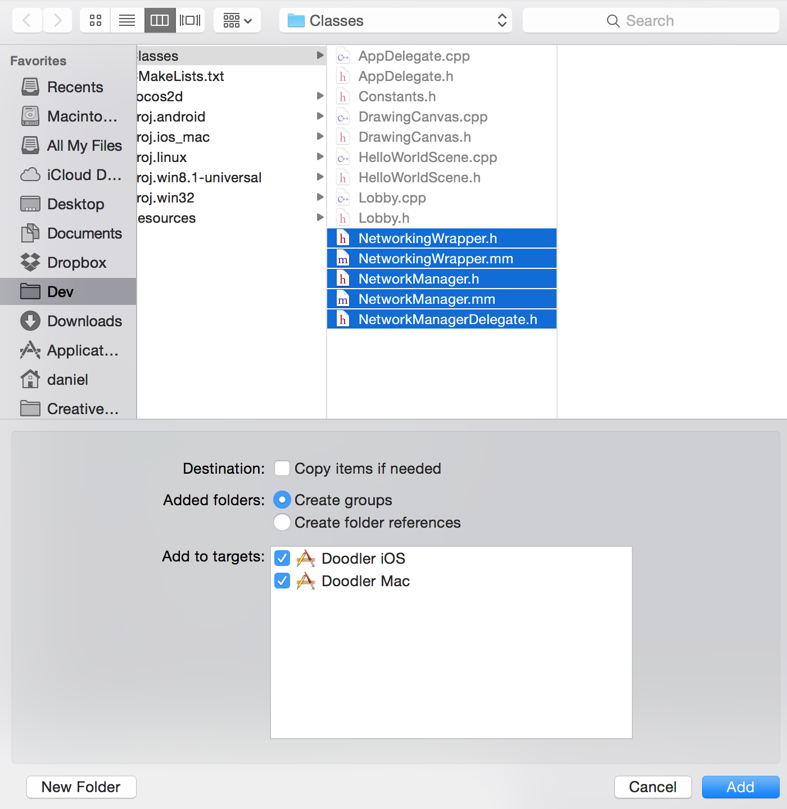
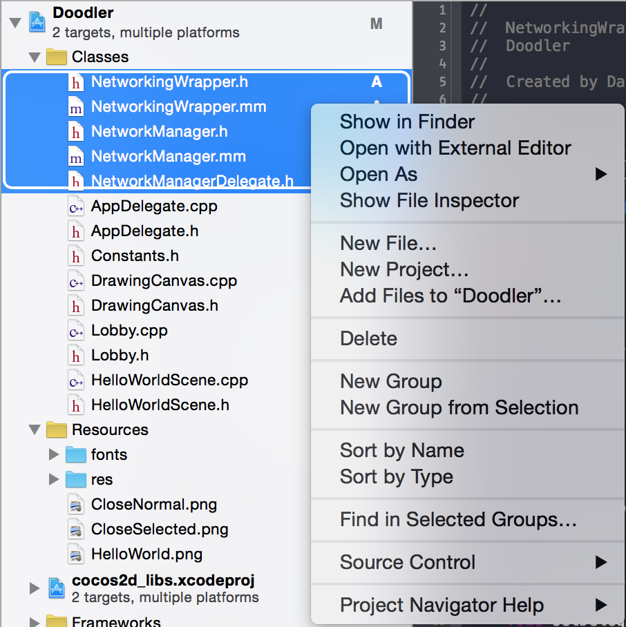
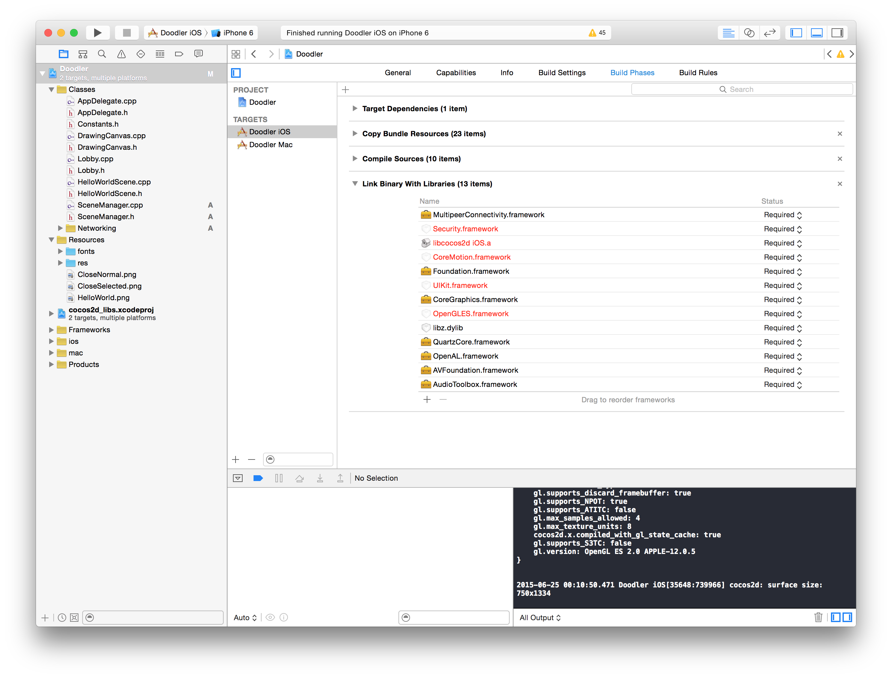
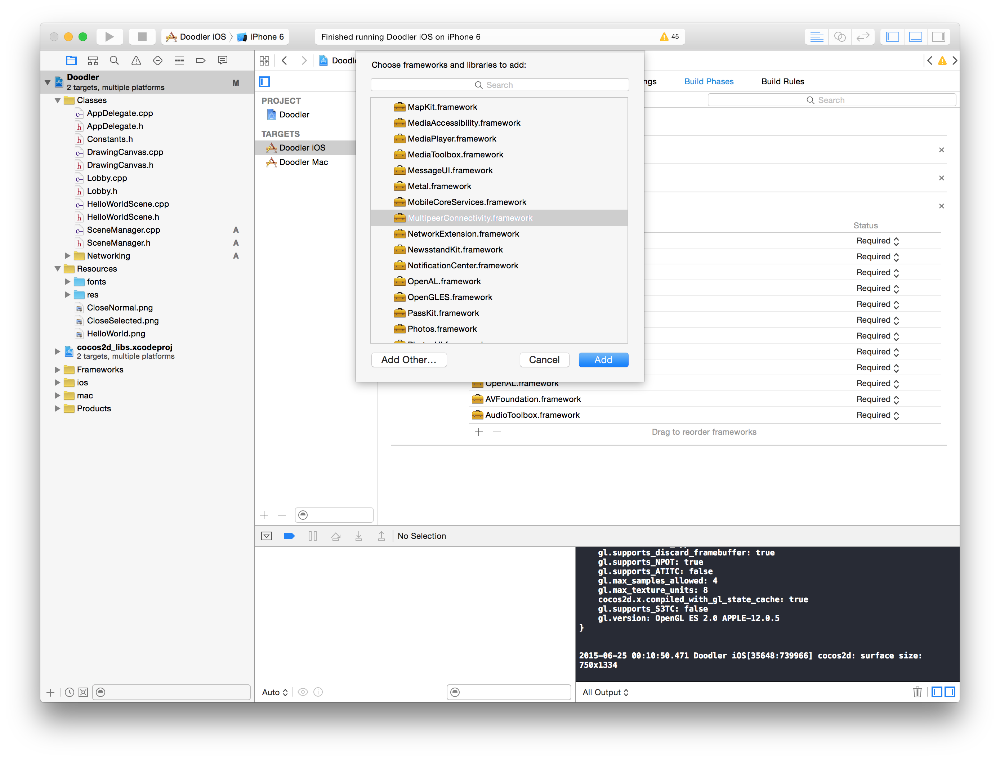

---
title: "Make it multiplayer"
slug: make-it-multiplayer
---     

#Add Network Wrapping Classes

Now that we've successfully polished the single player game, it's time to add two player functionality.

We will be using Apple's Multipeer Connectivity framework.  Multipeer Connectivity allows you to discover nearby peers, invite them to a session, and send and receive data to them. The connection itself is abstracted away from us, the client developers. It can either take place on Bluetooth or WiFi.

Because Multipeer Connectivity is written in Objective-C, we must also use Objective-C to interface with it. Fortunately, Objective-C code can be combined with C++, making a hybrid language called Objective-C++.

To make interfacing easier, we have provided classes that will allow you to write only C++ code to work with Multipeer Connectivity.

The first class is called *NetworkManager*. This is the Objective-C++ class that interfaces with Multipeer Connectivity directly. It handles browsing for peers, inviting peers, creating a session, and automatically reconnecting after a disconnect.

The second class is called *NetworkingWrapper*. This is an Objective-C++ class that communicates with NetworkManager. The public interface of NetworkingWrapper is in C++, so you can interface with NetworkingWrapper using only C++. NetworkingWrapper's public method calls will be translated to the equivalent Objective-C method call and passed on to NetworkManager.

There is a *NetworkManagerDelegate* interface, which is implemented by NetworkingWrapper. When the NetworkManager state changes, or when it receives data from the network, it passes that information on to NetworkingWrapper via the NetworkManagerDelegate interface. 

NetworkingWrapper also defines a delegate interface, called *NetworkingDelegate*. We will define a class in our app that inherits from the *NetworkingDelegate* interface so that we may receive communications from NetworkingWrapper.

It is a bit confusing. Here's a diagram to help you understand:

> [action]
> 
Download [this .zip file](https://raw.githubusercontent.com/MakeSchool-Tutorials/Doodler-Cpp/tree/master/P5-Make-it-Multiplayer/NetworkingClasses.zip) that contains the aformentioned classes.
>
Unzip it and move the files into the *Classes* directory in your project directory.
>

>
Open your Xcode project. Right click the *Classes* group and choose *Add Files to "Doodler"...*
>

>
Navigate to the *Classes* directory and highlight all the network classes. Make sure to check Add to targets for both Doodler iOS and Doodler Mac. Click add.
>

>
Next, hightlight those classes, right-click and choose *New Group from Selection*
>

>
Name the group "Networking".

Once projects begin to become complicated because they have many moving parts, it makes sense to start putting your classes into *groups*. Not only does it help you navigate between classes more easily, but it also forces you to think about the architecture of your game in a more structured manner.

#Add Multipeer Connectivity Framework

Only the most commonly used iOS frameworks are included in your project by default. In order to interface with the Multipeer Connectivity framework, we must first include it in our project.

> [action]
> 
Click the project in the project navigator.
>
Then click *build phases* and expand *Link Binary With Libraries*. 
>

>
Click the **+** button, find the MultipeerConnectivity.framework, then add it.
>

Once you've added it, move on to the next step.

#Make SceneManager

Take a look at *NetworkingWrapper.h*. This is the only class we really have to worry about, because it's the only one we will interface with to add networking support to the app.

`NetworkingWrapper` uses a very common pattern called *delegation* to ensure two-way communication between two classes. When we want to call a public method on `NetworkingWrapper`, we can just call it. But what about when we want `NetworkingWrapper` to communicate back to us, like for example, when it receives data from the other device? 

To accomplish that, we must create a class that implements the `NetworkingDelegate` interface (which is declared at the top of *NetworkingWrapper.h*). The `NetworkingDelegate` interface looks like this:

	class NetworkingDelegate
	{
	public:
	    virtual void receivedData(const void* data, unsigned long length) = 0;
	    virtual void stateChanged(ConnectionState state) = 0;
	};

Any class that wants to be a `NetworkingDelegate` must implement `receivedData()` and `stateChanged()`.

We're going to create a class called `SceneManager` that implements the `NetworkingDelegate` interface. Once we've done that, we can use the `setDelegate()` method in `NetworkingWrapper` to assign `SceneManager` as the class that should be notified about data received and networking state changes.

> [info]
> 
> `NetworkingDelegate` is an *abstract class*. It's called *abstract* because it cannot be instantiated, and it cannot be instantiated because it contains *pure virtual functions*. 
> 
> A pure virtual function is a function that is declared `virtual` and is assigned `= 0`. 
> 
Any class that inherits from an abstract class must override and implement all pure virtual functions, or else it becomes abstract itself.

In addition to handling the networking, `SceneManager` will be in charge of handling the transitions between the `Lobby` and `DrawingCanvas`. We want `SceneManager` to be in charge of this because, once a user presses the duo button, we don't want to load the `DrawingCanvas` until we have successfully connected to another device.

> [action]
> 
Create a new class called `SceneManager`. `SceneManager` should inherit from `NetworkingDelegate`. To do that, you must `#include "NetworkingWrapper.h"` in *SceneManager.h*.

`SceneManager` is going to be a *singleton*. That is, there will only ever be one instance of `SceneManager` that we interact with. That makes sense if you consider that `SceneManager` will be handling the transition between scenes - we don't want multiple instances of a class to be handling something like that - it can become confusing.

> [action]
> 
In *SceneManager.h*, declare a `public` method that looks like this:
>
	static SceneManager* getInstance();
	
In Cocos2d-x, whenever interacting with a singleton, you get the one instance of it with the `getInstance()` method. We will respect that style and do the same.

> [action]
> 
Flip to `SceneManager.cpp`. Now we're going to implement a standard singleton.
>
Declare the static reference to the shared instance:
>
	static SceneManager* sharedSceneManager = nullptr;
>	
Next implement the `getInstance()` method:
>
	SceneManager* SceneManager::getInstance()
	{
	    if (! sharedSceneManager)
	    {
	        sharedSceneManager = new SceneManager();
	    }
>	    
	    return sharedSceneManager;
	}
	
The compiler will complain:
> Allocating an object of abstract class type 'SceneManager'.

That's because we haven't yet overridden and created implementations for the pure virtual functions that we inherited from `NetworkingDelegate`.

> [action]
Let's do that now. In *SceneManager.h*, add the following `private` declarations:
>
    void receivedData(const void* data, unsigned long length) override;
    void stateChanged(ConnectionState state) override;
>
Then, in *SceneManager.cpp*, add empty implementations for `receivedData()` and `stateChanged()`.

That should clear up the error.

> [action]
> 
Next declare a `private` *constructor* and *destructor* in *SceneManager.h*. They look like this:
>
	SceneManager();
	~SceneManager();
	
We haven't really seen constructors or destructors so far, because Cocos2d-x like to manage the lifecycle of its objects through *reference counting*, and the `create()` and `init()` methods.

But because `SceneManager` doesn't inherit from a Cocos2d-x class, we're going to create it the old-school C++ way.

> [action]
> 
In *SceneManager.cpp*, add the implementations for the constructor and destructor:
>
	SceneManager::SceneManager()
	{
>	
	}
>
	SceneManager::~SceneManager()
	{
>
	}

Because `SceneManager` is in charge of the transitions between scenes, it will now manage the lifecycle of the `DrawingCanvas` that we display.

> [action]
> 
Add a `private` instance variable to *SceneManager.h*:
>
    DrawingCanvas* drawingCanvas;
    
The compiler will complain that it doesn't know what `DrawingCanvas` is. Instead of doing a `#include "DrawingCanvas.h"`, we're going to forward declare `DrawingCanvas`. 

> [action]
> 
Directly above where we declare this line:
>
	class SceneManager : public NetworkingDelegate
>	
Add this:
>
	class DrawingCanvas;
	
We do this so that we can minimize the number of `#include`s in our header files.

> [action]
> 
Now you can switch to *SceneManager.cpp* and `#include "DrawingCanvas.h` at the top.
>
We're going to wait to create an instance of `DrawingCanvas` until the user tells us to load it by clicking one of the lobby buttons. Let's make sure that `DrawingCanvas` is set to nullptr until that time by adding this to the constructor:
>
	drawingCanvas = nullptr;
	
We've created `SceneManager` but haven't actually used it to manage and scene transitions yet. Let's change that.

> [action]
> 
Declare and implement empty versions of these `public` methods in `SceneManager`:
>
    void enterSoloGame();
    void returnToLobby();
>   
Also declare and implement an empty version of this `private` method:
>
	void loadDrawingScene(bool networked); 
	
`enterSoloGame()` and `returnToLobby()` will do what they sound like - they'll tell the `SceneManager` to transition from one to another. `loadDrawingScene()` is a private helper method that we will use to create a new drawing scene. It's important we know whether it's a networked (2-player) or a non-networked (1-player) game, because we have to inform the `DrawingCanvas`. But we'll talk more about that later.

> [action]
> 
The implentation of `enterSoloGame()` is easy - it just offloads the work onto `loadDrawingScene()`:
>
	this->loadDrawingScene(false);
>	
`loadDrawingScene()` looks like this:
>
	void SceneManager::loadDrawingScene(bool networked)
	{
	    auto scene = Scene::create();
>	    
	    drawingCanvas = DrawingCanvas::create();
	    drawingCanvas->setNetworkedSession(networked);
>	    
	    scene->addChild(drawingCanvas);
>	    
	    Director::getInstance()->pushScene(scene);
	}
>
The compiler will probably complain that it doesn't know what a `Scene` is. You can fix that by declaring `using namespace cocos2d;` at the top.	

This code creates a scene, then makes a `DrawingCanvas`. It adds the `DrawingCanvas` as a child of the newly created scene, and then tells the `Director` to *push* the scene.

There's an important distinction to be made between pushing and replacing scenes. Pushing a scene pauses the previous one and displays the new one, but the old one remains in memory. That way it can be quickly restored by calling `popScene()`.

Replacing a scene will, in most cases, deallocate the old one.

> [action]
> 
Next the compiler will complain that there's no method `setNetworkedSession` in `DrawingCanvas`. Fix it! Declare a `protected` `bool` property in `DrawingCanvas` called `networkedSession`. Also declare and implement the `public` setter and getter methods.
>
Next let's implement `returnToLobby()` in `SceneManager`. First, check if `drawingCanvas` is not equal to `nullptr`. If it is then we must already be in the lobby, because we haven't yet created and transitioned into a drawing scene. If `drawingCanvas` is not equal to `nullptr` then tell the `Director` to pop the currently active scene, after which we should assign `drawingCanvas` equal to `nullptr` because it will have gotten deallocated.

<!--html comment to break boxes-->

> [solution]
> 
> It should look like this:
> 
	void SceneManager::returnToLobby()
	{
	    if (drawingCanvas)
	    {
	        Director::getInstance()->popScene();
	        drawingCanvas = nullptr;
	    }
	}

Now we've done enough that we can have `SceneManager` actually start taking responsibility for scene transitions. 

> [action]
> 
Go to *Lobby.cpp* and in the `soloPressed` callback delete all the code inside the `if` block. We can replace it with a call to `SceneManager` like this:
>
	SceneManager::getInstance()->enterSoloGame();
>
The compiler will complain about not knowing what `SceneManager` is... fix it!
>
Now go to *DrawingCanvas.cpp* and fix the `backPressed()` method so that it uses the `returnToLobby()` method in `SceneManager`.

At this point you can run the app! It should behave the exact same as before, except now there is only one class handling scene transitions, which is a much better architecture.

#Let's Get Connected

Now that we have single-player scene transitions working with `SceneManager`, let's add the code for the two-player mode.

First, we'll have `SceneManager` create an instance of the `NetworkingWrapper` class which will allow is to communicate over the network.

> [action]
> 
In *SceneManager.h*, declare a `private` instance variable for it:
>
    NetworkingWrapper* networkingWrapper;
>   
Now we'll create it in the `SceneManager`'s constructor:
>
    networkingWrapper = new NetworkingWrapper();
    networkingWrapper->setDelegate(this);

By setting ourselves as the delegate, we tell `networkingWrapper` to notify us of any data sent from the other device, or if the connection state has changed.

We used the `new` keyword to create `networkingWrapper` which means it won't get deallocated until we `delete` it. Thankfully, we've already created a destructor; we should delete it there:

	delete networkingWrapper;

Still in `SceneManager`, declare and implement this new `public` method:

    void connectAndEnterNetworkedGame(); 
    
The implementation is an easy one line - we tell the `networkingWrapper` to try to find us another device to play with:

	networkingWrapper->attemptToJoinGame();
	
The `NetworkManager` is set up to scan for other devices on the local Bluetooth and WiFi networks. If it finds another device that is also scanning, an invitation is sent, which is automatically accepted. Then both devices will begin the procedure to connect to each other.

As that happens, the `networkingWrapper` will inform us of connection state changes via the `stateChanged()` method. So let's implement that now.

> [action]
> 
There are three states, `NOT_CONNECTED`, `CONNECTING`, and `CONNECTED`. Let's use a `CCLOG()` to log to the console every time the state changes with a message that says what state we just transitioned to. This will be helpful later, when trying to figure out if two devices found each other or not.

<!--html comment for box break-->

> [solution]
> 
> You should have come up with something like this
>    
	switch (state)
	{
		case ConnectionState::NOT_CONNECTED:
			CCLOG("Not Connected");
			break;
>            
 		case ConnectionState::CONNECTING:
			CCLOG("Connecting...");
			break;
>            
		case ConnectionState::CONNECTED:
			CCLOG("Connected!");
			break;
    }
    
Now we should make it so that once both devices are connected, the game automatically transitions us to the drawing canvas.

> [action]
> 
When we are successfully connected, we can do this:
>
	if (!drawingCanvas)
	{	
		this->loadDrawingScene(true);
	}

The check to see if `drawingCanvas` already exists or not is important - if it does already exist then that means we're already in the drawing scene. In that case we don't want to reload a new one. This can actually happen fairly often - if a user is in a 2-player drawing session and they become disconnected, the `NetworkManager` will try to reconnect. If successful, we don't want to load a whole new drawing scene, and wipe out everything the user had already drawn!

> [action]
> 
We're almost ready to test if we can get two devices to connect to each other! First though, we have to hook up the duo button. Make it so that when the duo button is touched (and the touch has ended), it calls `connectAndEnterNetworkedGame()`.

Once you've done that you're ready to test! In order to test you will have to have at least one iOS device. You can run Doodler on that device, then change the build target to one of the iOS simulators, and run again. As long as your device and your computer are on the same WiFi network, they should be able to connect!

#Create the JSONPacker

In order for there to be communication between two devices, they must agree on a *protocol*, a set of standards by which they can transfer information. For this app, we're going to use the very popular [JSON](https://en.wikipedia.org/wiki/JSON) standard. JSON stands for Javascript Object Notation. JSON is popular because it works natively with Javascript, the most popular web development language. It also has a very simple syntax, and is human readable, which makes it easy to develop with.

If you are not familiar with JSON syntax, I recommend you read [this guide](http://adobe.github.io/Spry/articles/json_primer/json_primer.html).

We're going to create some utility methods and data structures that will help make it easy to pack line data into the JSON format and unpack JSON back into line data that can be drawn on the screen. We will be using the C++ based [rapidjson](https://miloyip.github.io/rapidjson/md_doc_tutorial.html) library which is included in Cocos2d-x to encode and decode the JSON strings.

> [action]
> 
Create a new C++ implementation and header file called JSONPacker. We're actually *not* going to create a class called JSONPacker, because we don't need to maintain any internal state to generate JSON. So we don't need to make a class, because there's no data members. Instead we'll adopt a more functional style - for any given input we will generate an output, and given the same input, the output will always be the same.

Because we're not going to create a class, we will instead have to create a namespace. Otherwise the methods we declare would be in the *global namespace*, and if any other methods in the global namespace happen to have the same name then we'll get linker errors.

> [action]
> 
This is what *JSONPacker.h* should look like.
>
	#include "cocos2d.h"
>
	namespace JSONPacker
	{
>
	struct LineData
	{
	    cocos2d::Vec2 startPoint;
	    cocos2d::Vec2 endPoint;
	    cocos2d::Color4F color;
	    float radius;
	};
>
	LineData unpackLineDataJSON(std::string json);
	std::string packLineData(LineData lineData);
>
	}
	
We declared `LineData` and our two packing methods in the `JSONPacker` namespace, which means when we want to access those in the future we will have to do so with the scope resolution operator, like this: `JSONPacker::LineData`. 

We create `LineData` as a convenient way to store everything necessary to draw a line on the screen as a single variable. Notice that `unpackLineDataJSON` takes a JSON string as an input, and returns a `LineData` object as output. Being able to return 4 different variables in one `LineData` object is very convenient.

> [action]
> 
Switch over to *JSONPacker.cpp* so we can code the implementations of `unpackLineDataJSON` and `packLineData`.
>
First, let's declare
>
	using namespace cocos2d;
>	
Which will save us some typing in the future.
>
Next, we will write 
>
	namespace JSONPacker 
	{
>	
	}
>	
So that our implementations are also in the `JSONPacker` namespace.
>	
Let's also `#include` all the files we'll need from the rapidjson framework at the top:
>
	#include "json/document.h"
	#include "json/writer.h"
	#include "json/stringbuffer.h"
	

>
First we will code `packLineData` (inside the `namespace` declaration!):
>
	std::string packLineData(LineData lineData)
	{
>
	}
>	
Declare a rapidjson Document object:
>
	rapidjson::Document document;
	
We will be manipulating the contents of the `document` as we add our line data to it. `Document` is designed to be very fast to manipulate in C++. Only when we're finished manipulating the contents of `document`, do we convert it into a JSON string.

> [action]
> 
Next we tell `document` what the root Javascript data-structure is.
>
	document.SetObject();
	
In this case we set the root structure to an *object*, but it could have also been an *array* or a value type like *bool* or *int*.

> [action]
> 
Next we'll create an object-type `rapidjson::Value` representing the startPoint of the line:
>
    rapidjson::Value startPt(rapidjson::kObjectType);
    startPt.AddMember("x", lineData.startPoint.x, document.GetAllocator());
    startPt.AddMember("y", lineData.startPoint.y, document.GetAllocator());
>    
Now create a similar object-type `rapidjson::Value` called `endPt` that will store `lineData.endPoint.x` and `lineData.endPoint.y`.
>
Next we'll create the JSON object to store the RGBA color of the line:
>
    rapidjson::Value lineColor(rapidjson::kObjectType);
    lineColor.AddMember("r", lineData.color.r, document.GetAllocator());
    lineColor.AddMember("g", lineData.color.g, document.GetAllocator());
    lineColor.AddMember("b", lineData.color.b, document.GetAllocator());
    lineColor.AddMember("a", lineData.color.a, document.GetAllocator());
>   
After that we add the `startPt`, `endPt`, and `lineColor` objects that we've created to the document, in addition to `radius`.
>
	document.AddMember("startPoint", startPt, document.GetAllocator());
    document.AddMember("endPoint", endPt, document.GetAllocator());
    document.AddMember("radius", lineData.radius, document.GetAllocator());
    document.AddMember("color", lineColor, document.GetAllocator());
>   
Now we begin the steps to convert the `document` into a `string`. We make a `rapidjson::StringBuffer` in which we'll store the JSON string created by a `rapidjson::Writer`
>
	 rapidjson::StringBuffer buffer;
    rapidjson::Writer<rapidjson::StringBuffer> writer(buffer);
    document.Accept(writer);
>   
The last step is to convert the `StringBuffer` into a `std::string` that we can return as the output of our function.
>
	return std::string(buffer.GetString(), buffer.Size());
	
Great! Now we need to code `unpackLineDataJSON()`. This function will do the opposite of what `packLineData()` does - it will accept a `std::string` as input and will parse it into a `rapidjson::Document`. We can then access the values in the `Document` in order to populate a `LineData` `struct` that we will return.

Start out by creating a document, and populating it by parsing the input `string`:

	rapidjson::Document document;
	document.Parse<0>(json.c_str());
	
The `<0>` in `Parse` is some optional flags that can alter the behavior of `Parse`, but in this case we don't need any.

Next, we populate three of the JSON objects that we created when we packed it, the starting point, end point and color:

    rapidjson::Value& startDoc = document["startPoint"];
    rapidjson::Value& endDoc = document["endPoint"];
    rapidjson::Value& colorDoc = document["color"];
    
The `&` is called the *reference operator*. It says "instead of creating a new copy of `startDoc`, just give me the same object that is in the document data structure already." It's helpful to use references to objects when you're sure you won't manipulate the value, because that saves having to create a copy of the object.

Next we convert the `document` values to types that are more useful in Cocos2d-x:

    Vec2 start = Vec2(startDoc["x"].GetDouble(), startDoc["y"].GetDouble());
    Vec2 end = Vec2(endDoc["x"].GetDouble(), endDoc["y"].GetDouble());
    float radius = document["radius"].GetDouble();
    
Also we populate a `Color4F` with the color that we are supposed to display:

    float r = colorDoc["r"].GetDouble();
    float g = colorDoc["g"].GetDouble();
    float b = colorDoc["b"].GetDouble();
    float a = colorDoc["a"].GetDouble();
    Color4F color = Color4F(r, g, b, a);
   
Finally, we create a new `LineData` object, and populate it before we return it.

    LineData result;
    result.startPoint = start;
    result.endPoint = end;
    result.radius = radius;
    result.color = color;
    return result;
    
With that we have coded all the functions we need to encode and decode JSON strings. More complicated games might have many more JSON messages and encoders, but this is all we need for Doodler.

    

    
    