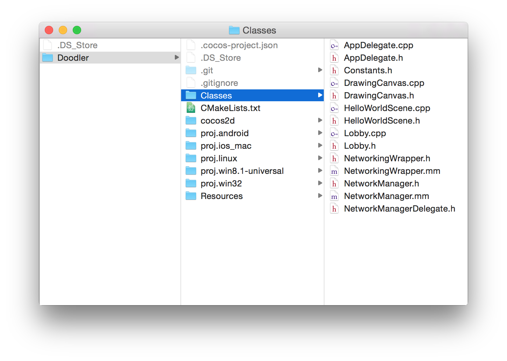

---
title: "Make it multiplayer"
slug: make-it-multiplayer
---     

#Add Network Wrapping Classes

Now that we've successfully polished the single player game, it's time to add two player functionality.

We will be using Apple's Multipeer Connectivity framework.  Multipeer Connectivity allows you to discover nearby peers, invite them to a session, and send and receive data to them. The connection itself is abstracted away from us, the client developers. It can either take place on Bluetooth or WiFi.

Because Multipeer Connectivity is written in Objective-C, we must also use Objective-C to interface with it. Fortunately, Objective-C code can be combined with C++, making a hybrid language called Objective-C++.

To make interfacing easier, we have provided classes that will allow you to write only C++ code to work with Multipeer Connectivity.

The first class is called *NetworkManager*. This is the Objective-C++ class that interfaces with Multipeer Connectivity directly. It handles browsing for peers, inviting peers, creating a session, and automatically reconnecting after a disconnect.

The second class is called *NetworkingWrapper*. This is an Objective-C++ class that communicates with NetworkManager. The public interface of NetworkingWrapper is in C++, so you can interface with NetworkingWrapper using only C++. NetworkingWrapper's public method calls will be translated to the equivalent Objective-C method call and passed on to NetworkManager.

There is a *NetworkManagerDelegate* interface, which is implemented by NetworkingWrapper. When the NetworkManager state changes, or when it receives data from the network, it passes that information on to NetworkingWrapper via the NetworkManagerDelegate interface. 

NetworkingWrapper also defines a delegate interface, called *NetworkingDelegate*. We will define a class in our app that inherits from the *NetworkingDelegate* interface so that we may receive communications from NetworkingWrapper.

It is a bit confusing. Here's a diagram to help you understand:

> [action]
> 
Download [this .zip file](https://raw.githubusercontent.com/MakeSchool-Tutorials/Doodler-Cpp/tree/master/P5-Make-it-Multiplayer/NetworkingClasses.zip) that contains the aformentioned classes.
>
Unzip it and move the files into the *Classes* directory in your project directory.
>

>
Open your Xcode project. Right click the *Classes* group and choose *Add Files to "Doodler"...*
>

>
Navigate to the *Classes* directory and highlight all the network classes. Make sure to check Add to targets for both Doodler iOS and Doodler Mac. Click add.
>

>
Next, hightlight those classes, right-click and choose *New Group from Selection*
>

>
Name the group "Networking".

Once projects begin to become complicated because they have many moving parts, it makes sense to start putting your classes into *groups*. Not only does it help you navigate between classes more easily, but it also forces you to think about the architecture of your game in a more structured manner.

#Add Multipeer Connectivity Framework

Only the most commonly used iOS frameworks are included in your project by default. In order to interface with the Multipeer Connectivity framework, we must first include it in our project.

> [action]
> 
Click the project in the project navigator.
>
Then click *build phases* and expand *Link Binary With Libraries*. 
>

>
Click the **+** button, find the MultipeerConnectivity.framework, then add it.
>

Once you've added it, move on to the next step.

#Make SceneManager

Take a look at *NetworkingWrapper.h*. This is the only class we really have to worry about, because it's the only one we will interface with to add networking support to the app.

`NetworkingWrapper` uses a very common pattern called *delegation* to ensure two-way communication between two classes. When we want to call a public method on `NetworkingWrapper`, we can just call it. But what about when we want `NetworkingWrapper` to communicate back to us, like for example, when it receives data from the other device? 

To accomplish that, we must create a class that implements the `NetworkingDelegate` interface (which is declared at the top of *NetworkingWrapper.h*). The `NetworkingDelegate` interface looks like this:

	class NetworkingDelegate
	{
	public:
	    virtual void receivedData(const void* data, unsigned long length) = 0;
	    virtual void stateChanged(ConnectionState state) = 0;
	};

Any class that wants to be a `NetworkingDelegate` must implement `receivedData()` and `stateChanged()`.

We're going to create a class called `SceneManager` that implements the `NetworkingDelegate` interface. Once we've done that, we can use the `setDelegate()` method in `NetworkingWrapper` to assign `SceneManager` as the class that should be notified about data received and networking state changes.

> [info]
> 
> `NetworkingDelegate` is an *abstract class*. It's called *abstract* because it cannot be instantiated, and it cannot be instantiated because it contains *pure virtual functions*. 
> 
> A pure virtual function is a function that is declared `virtual` and is assigned `= 0`. 
> 
Any class that inherits from an abstract class must override and implement all pure virtual functions, or else it becomes abstract itself.

In addition to handling the networking, `SceneManager` will be in charge of handling the transitions between the `Lobby` and `DrawingCanvas`. We want `SceneManager` to be in charge of this because, once a user presses the duo button, we don't want to load the `DrawingCanvas` until we have successfully connected to another device.

> [action]
> 
Create a new class called `SceneManager`. `SceneManager` should inherit from `NetworkingDelegate`. To do that, you must `#include "NetworkingWrapper.h"` in *SceneManager.h*.

`SceneManager` is going to be a *singleton*. That is, there will only ever be one instance of `SceneManager` that we interact with. That makes sense if you consider that `SceneManager` will be handling the transition between scenes - we don't want multiple instances of a class to be handling something like that - it can become confusing.

> [action]
> 
In *SceneManager.h*, declare a `public` method that looks like this:
>
	static SceneManager* getInstance();
	
In Cocos2d-x, whenever interacting with a singleton, you get the one instance of it with the `getInstance()` method. We will respect that style and do the same.

> [action]
> 
Flip to `SceneManager.cpp`. Now we're going to implement a standard singleton.
>
Declare the static reference to the shared instance:
>
	static SceneManager* sharedSceneManager = nullptr;
>	
Next implement the `getInstance()` method:
>
	SceneManager* SceneManager::getInstance()
	{
	    if (! sharedSceneManager)
	    {
	        sharedSceneManager = new SceneManager();
	    }
>	    
	    return sharedSceneManager;
	}
	
The compiler will complain:
> Allocating an object of abstract class type 'SceneManager'.

That's because we haven't yet overridden and created implementations for the pure virtual functions that we inherited from `NetworkingDelegate`.

> [action]
Let's do that now. In *SceneManager.h*, add the following `private` declarations:
>
    void receivedData(const void* data, unsigned long length) override;
    void stateChanged(ConnectionState state) override;
>
Then, in *SceneManager.cpp*, add empty implementations for `receivedData()` and `stateChanged()`.

That should clear up the error.

> [action]
> 
Next declare a `private` *constructor* and *destructor* in *SceneManager.h*. They look like this:
>
	SceneManager();
	~SceneManager();
	
We haven't really seen constructors or destructors so far, because Cocos2d-x like to manage the lifecycle of its objects through *reference counting*, and the `create()` and `init()` methods.

But because `SceneManager` doesn't inherit from a Cocos2d-x class, we're going to create it the old-school C++ way.

> [action]
> 
In *SceneManager.cpp*, add the implementations for the constructor and destructor:
>
	SceneManager::SceneManager()
	{
>	
	}
>
	SceneManager::~SceneManager()
	{
>
	}

Because `SceneManager` is in charge of the transitions between scenes, it will now manage the lifecycle of the `DrawingCanvas` that we display.

> [action]
> 
Add a `private` instance variable to *SceneManager.h*:
>
    DrawingCanvas* drawingCanvas;
    
The compiler will complain that it doesn't know what `DrawingCanvas` is. Instead of doing a `#include "DrawingCanvas.h"`, we're going to forward declare `DrawingCanvas`. 

> [action]
> 
Directly above where we declare this line:
>
	class SceneManager : public NetworkingDelegate
>	
Add this:
>
	class DrawingCanvas;
	
We do this so that we can minimize the number of `#include`s in our header files.

> [action]
> 
Now you can switch to *SceneManager.cpp* and `#include "DrawingCanvas.h` at the top.
>
We're going to wait to create an instance of `DrawingCanvas` until the user tells us to load it by clicking one of the lobby buttons. Let's make sure that `DrawingCanvas` is set to nullptr until that time by adding this to the constructor:
>
	drawingCanvas = nullptr;
	
We've created `SceneManager` but haven't actually used it to manage and scene transitions yet. Let's change that.

> [action]
> 
Declare and implement empty versions of these `public` methods in `SceneManager`:
>
    void enterSoloGame();
    void returnToLobby();
>   
Also declare and implement an empty version of this `private` method:
>
	void loadDrawingScene(bool networked); 
	
`enterSoloGame()` and `returnToLobby()` will do what they sound like - they'll tell the `SceneManager` to transition from one to another. `loadDrawingScene()` is a private helper method that we will use to create a new drawing scene. It's important we know whether it's a networked (2-player) or a non-networked (1-player) game, because we have to inform the `DrawingCanvas`. But we'll talk more about that later.

> [action]
> 
The implentation of `enterSoloGame()` is easy - it just offloads the work onto `loadDrawingScene()`:
>
	this->loadDrawingScene(false);
>	
`loadDrawingScene()` looks like this:
>
	void SceneManager::loadDrawingScene(bool networked)
	{
	    auto scene = Scene::create();
>	    
	    drawingCanvas = DrawingCanvas::create();
	    drawingCanvas->setNetworkedSession(networked);
>	    
	    scene->addChild(drawingCanvas);
>	    
	    Director::getInstance()->pushScene(scene);
	}
>
The compiler will probably complain that it doesn't know what a `Scene` is. You can fix that by declaring `using namespace cocos2d;` at the top.	

This code creates a scene, then makes a `DrawingCanvas`. It adds the `DrawingCanvas` as a child of the newly created scene, and then tells the `Director` to *push* the scene.

There's an important distinction to be made between pushing and replacing scenes. Pushing a scene pauses the previous one and displays the new one, but the old one remains in memory. That way it can be quickly restored by calling `popScene()`.

Replacing a scene will, in most cases, deallocate the old one.

> [action]
> 
Next the compiler will complain that there's no method `setNetworkedSession` in `DrawingCanvas`. Fix it! Declare a `protected` `bool` property in `DrawingCanvas` called `networkedSession`. Also declare and implement the `public` setter and getter methods.
>
Next let's implement `returnToLobby()` in `SceneManager`. First, check if `drawingCanvas` is not equal to `nullptr`. If it is then we must already be in the lobby, because we haven't yet created and transitioned into a drawing scene. If `drawingCanvas` is not equal to `nullptr` then tell the `Director` to pop the currently active scene, after which we should assign `drawingCanvas` equal to `nullptr` because it will have gotten deallocated.

<!--html comment to break boxes-->

> [solution]
> 
> It should look like this:
> 
	void SceneManager::returnToLobby()
	{
	    if (drawingCanvas)
	    {
	        Director::getInstance()->popScene();
	        drawingCanvas = nullptr;
	    }
	}

Now we've done enough that we can have `SceneManager` actually start taking responsibility for scene transitions. 

> [action]
> 
Go to *Lobby.cpp* and in the `soloPressed` callback delete all the code inside the `if` block. We can replace it with a call to `SceneManager` like this:
>
	SceneManager::getInstance()->enterSoloGame();
>
The compiler will complain about not knowing what `SceneManager` is... fix it!
>
Now go to *DrawingCanvas.cpp* and fix the `backPressed()` method so that it uses the `returnToLobby()` method in `SceneManager`.

At this point you can run the app! It should behave the exact same as before, except now there is only one class handling scene transitions, which is a much better architecture.